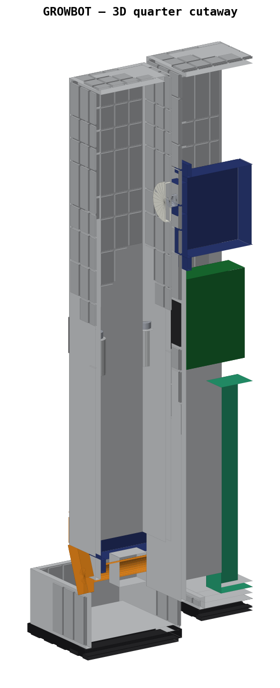
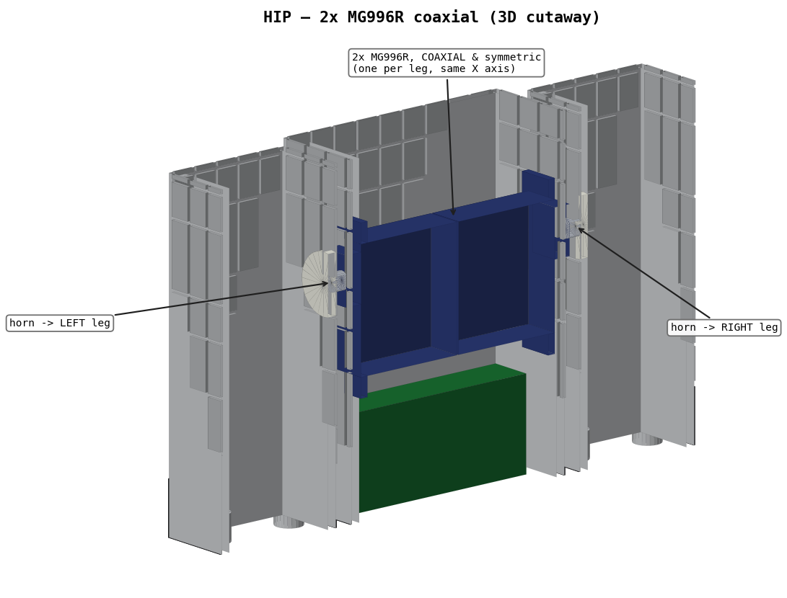
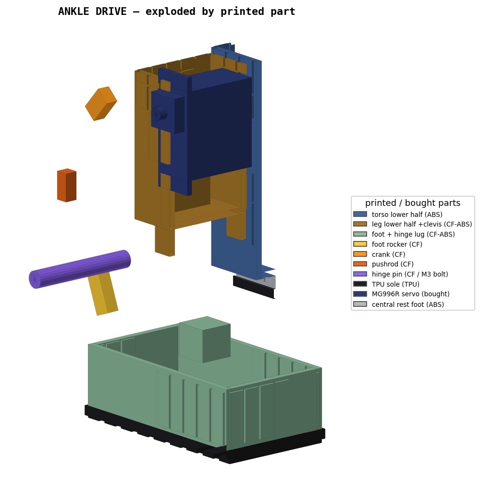

<div align="center">

# Growbot

**An open-source, TARS-inspired bipedal robot — body, simulation, and (eventually) a brain.**



[](#project-status)
[](#roadmap)
[](#quickstart)
[](#license)

</div>

---

## What is Growbot?

Growbot is a **real, buildable bipedal robot** inspired by the **TARS** monolith from
*Interstellar* — the faithful "one big rectangle + two small rectangle legs" silhouette,
**not** the 4-panel transforming toy. It's a ~290 mm (≈11.4 in), ~1.4 kg robot with three
vertical slabs:

- a **central torso** that houses the battery + electronics and doubles as a raised
  rest-foot (tripod anti-tip support), and
- **two outer leg slabs**, each with a hip-pitch and an ankle-pitch joint and a TPU-soled foot.

The long-term goal of this repository is to be a **complete, reproducible open platform**:
the 3D-printable body, the simulation + training code and learned weights for locomotion,
and the higher-level "brain" — vision, voice, and memory. Everything you'd need to build
your own.

> **This project is early.** Right now the repo contains the **3D model and the
> simulation-prep assets** only. Locomotion training, the physical build, and the
> perception/voice/memory stack are on the [roadmap](#roadmap) below — contributions welcome.

---

## Project status

| Area | State |
|---|---|
| Parametric 3D model (body + drivetrain + internals) | ✅ **Done** |
| Simulation assets (URDF, inertia, collision) + Isaac Lab guide | ✅ **Done** |
| Locomotion policy (RL / CPG) — code + weights | 🔜 Next |
| Physical build bring-up (print, wire, firmware, calibrate) | ⬜ Planned |
| Vision / perception | ⬜ Planned |
| Audio I/O (voice in + out) | ⬜ Planned |
| Memory + agentic behavior | ⬜ Planned |

---

## Roadmap

- [x] **Body** — parametric CAD generator: hollow ABS shells, direct-drive servo
      drivetrain, battery/electronics layout, TARS panel aesthetic, print splits.
- [x] **Simulation prep** — URDF with 4 actuated DOF, analytic per-link inertia,
      box collision, validated and ready for NVIDIA Isaac Lab. See
      [`ISAAC_LAB_SETUP.md`](ISAAC_LAB_SETUP.md).
- [ ] **Locomotion** — train a walking policy in Isaac Lab (RL and/or a CPG gait),
      publish the training code and weights.
- [ ] **Real build** — bill of materials, print profiles, wiring harness, servo
      calibration, and a Raspberry Pi firmware/control stack.
- [ ] **Vision** — onboard camera(s) and perception.
- [ ] **Audio** — speech-to-text in, text-to-speech out (the TARS conversational feel).
- [ ] **Memory & agency** — persistent memory and higher-level autonomous behavior.

---

## The robot at a glance

| | |
|---|---|
| **Height** | 290 mm (≈11.4 in) |
| **Footprint** | 193 × 97 mm |
| **Mass** | ~1.4 kg (analytic estimate: 1.44 kg incl. fasteners) |
| **Actuated DOF** | 4 — 2× hip-pitch, 2× ankle-pitch (all about the lateral axis) |
| **Actuators** | 4× TowerPro **MG996R** hobby servos (direct-drive hips; pushrod ankles) |
| **Compute** | Raspberry Pi **Zero 2 W** + PCA9685 servo driver + MPU-6050 IMU |
| **Power** | 2S 7.4 V 3300 mAh LiPo → XL4016 buck @6 V (servos) + MP1584 @5 V (Pi) |
| **Structure** | 3 mm hollow ABS shells; CF-ABS drive parts; TPU soles |
| **Center of mass** | X≈0, ~125 mm up — **below the hips** → pendulum-stable |

Full details, BOM, wiring and design rationale are in
[`HANDOFF.md`](HANDOFF.md) and [`Growbot_TARS_spec.md`](Growbot_TARS_spec.md).

---

## Repository layout

```
.
├── generate_growbot.py      # ★ parametric model generator — the source of truth
├── Growbot_TARS.obj / .mtl   # the generated model (mm, 30 named part groups)
├── Growbot_TARS_spec.md      # spec: dimensions, drivetrain, print/assembly notes
├── HANDOFF.md                # full state capsule (read this to resume work)
│
├── render_sections.py        # 2D cross-section / cutaway renderer
├── assembly_3d/              # ★ true-3D isometric cutaways + exploded views
│   └── render3d.py
│
├── isaac_lab/                # ★ NVIDIA Isaac Lab simulation assets
│   ├── growbot.urdf          #   5 links, 4 revolute DOF, box collisions, analytic inertia
│   ├── meshes/               #   per-link visual meshes (metres, Z-up/X-forward)
│   ├── build_isaac_assets.py #   regenerates the URDF + meshes + inertia from the model
│   ├── validate_urdf.py      #   offline sanity checks (topology, units, inertia validity)
│   ├── growbot_cfg_TEMPLATE.py  # Isaac Lab ArticulationCfg starter
│   └── inertia_report.md     #   per-link mass / CoM / inertia + validation results
├── ISAAC_LAB_SETUP.md        # ★ step-by-step sim/training setup guide (start here for sim)
│
├── Interstellar-TARS.*        # reference: the original TARS toy model
└── Reference images/          # reference photos
```

★ = the best places to start.

---

## Quickstart

Requirements: **Python 3** and **NumPy** (model generation + sim asset build);
**Matplotlib** is only needed for the renders.

```bash
# 1) (re)generate the 3D model from parameters — prints the bounding box + mass
python3 generate_growbot.py

# 2) render the true-3D cutaway / exploded / print-part views
python3 assembly_3d/render3d.py        # outputs assembly_3d/*.png

# 3) build + validate the Isaac Lab simulation assets
python3 isaac_lab/build_isaac_assets.py
python3 isaac_lab/validate_urdf.py     # should print "ALL CHECKS PASSED"
```

**Tweak the robot:** every dimension is a parameter at the top of
`generate_growbot.py` (`STAND_H`, slab widths, `HIP_Y`, foot size, joint radii, …).
Edit, re-run step 1, then re-run step 3 to refresh the sim assets.

**Run it in simulation:** Isaac Sim/Lab needs an NVIDIA RTX GPU (Linux/Windows or
cloud — it does **not** run on macOS). The full beginner walkthrough — install,
URDF→USD conversion, the ArticulationRoot gotcha, and wiring up an RL task — is in
[`ISAAC_LAB_SETUP.md`](ISAAC_LAB_SETUP.md).

---

## Design highlights

- **TARS silhouette, real hardware.** Three monolith slabs with the signature panel-line
  grid, dark grip bands, and gridded end-caps — all modeled as real relief geometry, not
  textures, so it shows up in any slicer.
- **Direct-drive servos, no gearboxes.** Re-estimated light (~1.4 kg), so the hips drive
  the legs directly (the MG996R's internal gearbox is the only reduction). The two hip
  servos are **coaxial and symmetric** (back-to-back on one axis) so there's no fore/aft
  asymmetry for the controller to fight.
- **Pushrod ankles.** Each ankle servo stands inside the lower leg and drives a
  crank → pushrod → foot-rocker 4-bar, so the foot stays slim while the motor lives where
  there's room.
- **Low, stable mass.** Battery sits low in the torso; CoM is below the hips → the body
  hangs like a pendulum. Wide, long feet add a static base.
- **Designed to actually print.** Tall slabs are bed-split at a bolted seam hidden in a
  dark accent band; heat-set inserts and M3 screws at every joint.

<div align="center">


</div>

---

## Documentation

| Doc | What's in it |
|---|---|
| [`HANDOFF.md`](HANDOFF.md) | Full project state capsule — dimensions, BOM, wiring, mass/CoM, caveats |
| [`Growbot_TARS_spec.md`](Growbot_TARS_spec.md) | Spec: coordinate system, drivetrain, print & assembly notes |
| [`ISAAC_LAB_SETUP.md`](ISAAC_LAB_SETUP.md) | Simulation setup + training handoff (beginner-friendly) |
| [`isaac_lab/inertia_report.md`](isaac_lab/inertia_report.md) | Computed per-link mass / CoM / inertia + validation |

---

## Contributing

This is an open project and help is very welcome — especially on the next milestones:
locomotion training, a real-build guide, and the perception/voice/memory stack.

- **Open an issue** to discuss a feature, report a problem, or propose a direction.
- **Keep the model parametric.** Geometry changes should go through
  `generate_growbot.py` (the source of truth), not hand-edits to the `.obj`. Re-run the
  generator and `isaac_lab/build_isaac_assets.py`, and make sure
  `isaac_lab/validate_urdf.py` still passes.
- **Document decisions** in `HANDOFF.md` so work can resume cold.

---

## License

**To be finalized.** Recommended for an open hardware + software + models project:

- **Code** (generators, training, control) → MIT or Apache-2.0
- **Hardware / 3D models** → CERN-OHL-S or CC-BY-SA-4.0
- **Docs** → CC-BY-4.0

Until a `LICENSE` file is added, no explicit license is granted. *(Maintainer: pick a
license and drop in the `LICENSE` file — happy to add the standard texts.)*

---

## Acknowledgements

Inspired by **TARS** from Christopher Nolan's *Interstellar* (Warner Bros. / Legendary).
Growbot is an **independent, fan-inspired original design** — it is not affiliated with,
endorsed by, or derived from the film's assets; references to "TARS" are nominative.
The `Interstellar-*` reference files are third-party fan models included only for visual
comparison and retain their original licenses.
